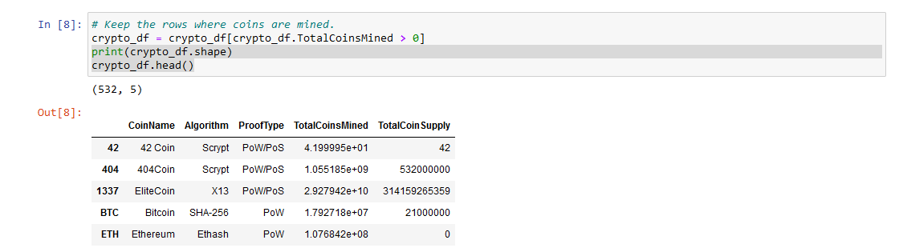
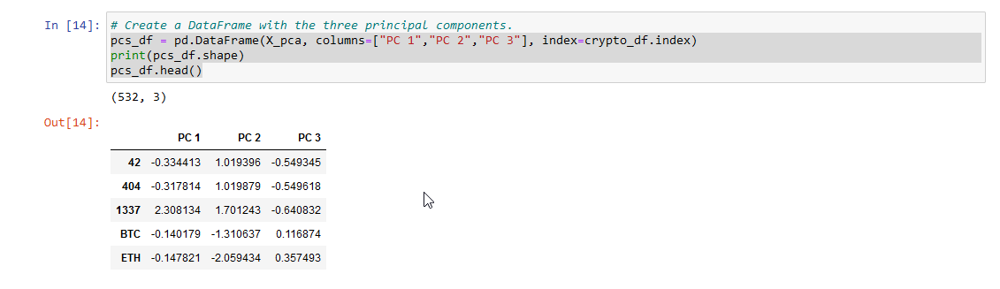
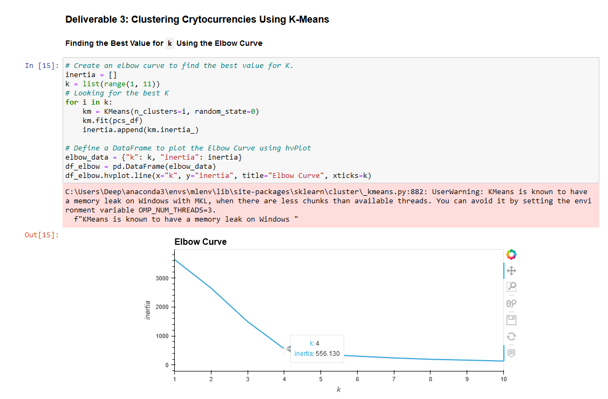
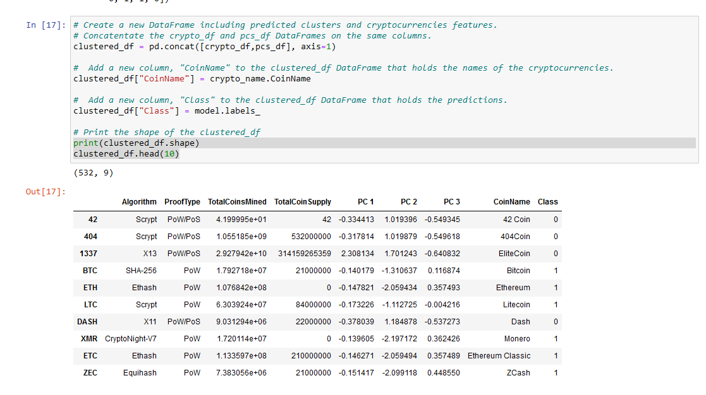
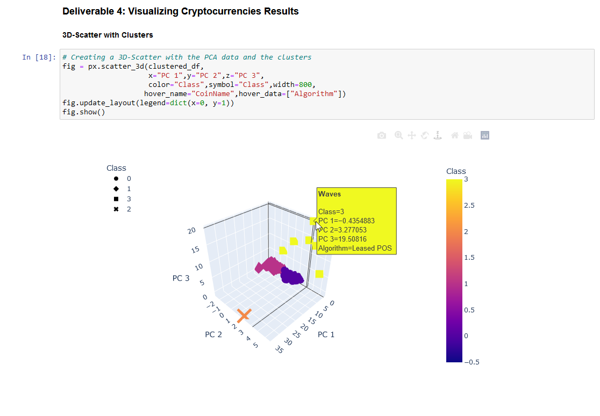
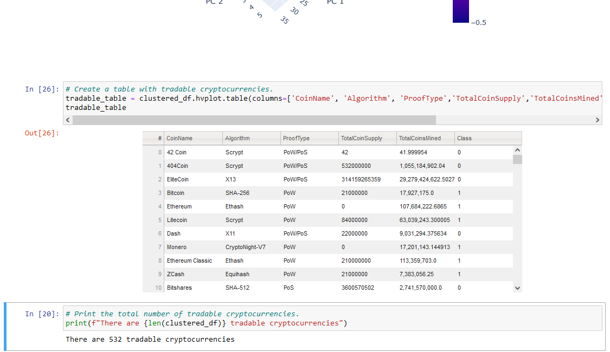
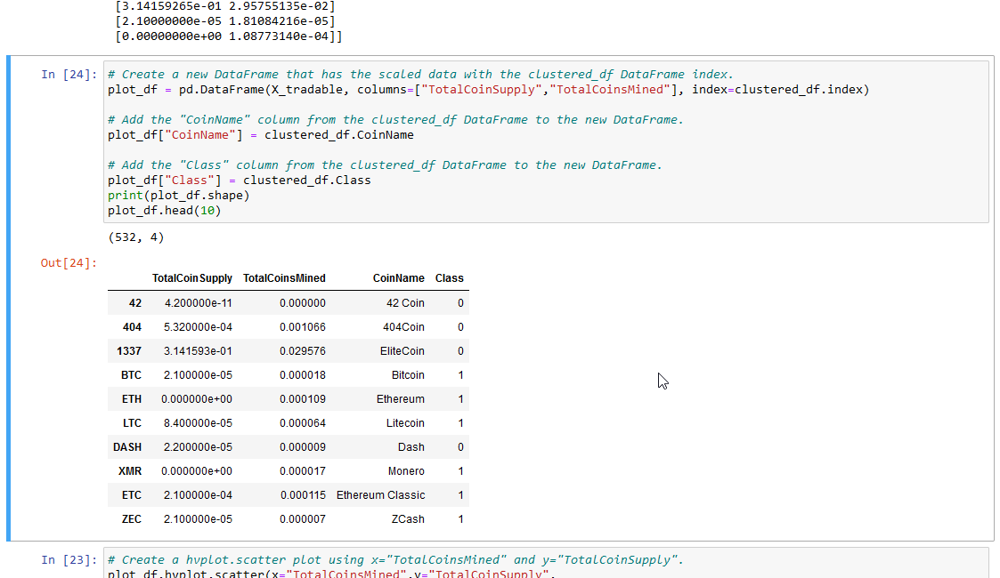
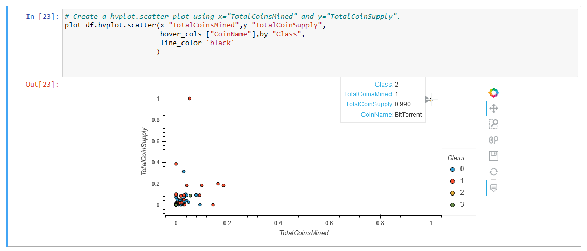

# Cryptocurrencies

# Module 18 Challenge-

This written analysis contains three sections:

**1. Overview of the analysis**

**2. Results**

**3. Summary**
 
## 1. Overview of the analysis

The aim of the analysis was to help Martha, a senior manager for the Advisory Services Team at Accountability Accounting, a prominent investment bank. The bank is interested in offering a new cryptocurrency investment portfolio for its customers. The company, however, is lost in the vast universe of cryptocurrencies. So, they’ve asked you to create a report that includes what cryptocurrencies are on the trading market and how they could be grouped to create a classification system for this new investment.

The base dataset is not ideal, so it will need to be processed to fit the machine learning models. Since there is no known output for what Martha is looking for, we are using unsupervised learning. To group the cryptocurrencies, a clustering algorithm will be used after which we'll use data visualizations to share the findings with the board.

## 2. Results

The major steps for this assignment are as follows,

### *a. Preprocessing the data for PCA*

* The base dataset was preprocessed into a `crypto_df` table as below:

* The features from the DataFrame were then standardized using the StandardScaler fit_transform() function
### *b. Reducing Data Dimensions Using PCA*

*  The dimensions of the DataFrame was reduced to three principal components and placed in a new DataFrame.

### *c. Clustering Cryptocurrencies Using K-means*

* An elbow curve using hvPlot was generated to find the best value for K from the `pcs_df` DataFrame. 

* Then, using **k=4** the K-means algorithm was run to predict the K clusters for the cryptocurrencies’ data.

### *d. Visualizing Cryptocurrencies Results*

* A scatter plot with Plotly Express and hvplot,  was created to visualize the distinct groups that correspond to the three principal components created earlier.

*  Then a table with all the currently tradable cryptocurrencies was created. 

* A DataFrame is created that contains the clustered_df DataFrame index, the scaled data, and the `CoinName` and `Class` columns for the scatter plot.

* A `hvplot` scatter plot is created where the X-axis is `TotalCoinsMined`, the Y-axis is `TotalCoinSupply`, the data is ordered by `Class`, and it shows the `CoinName` when you hover over the data poin

## 3. Summary

### Results

A total of **532 cryptocurrencies** were identified from the dataset which can be broken into **4 major clusters** based on their attributes.